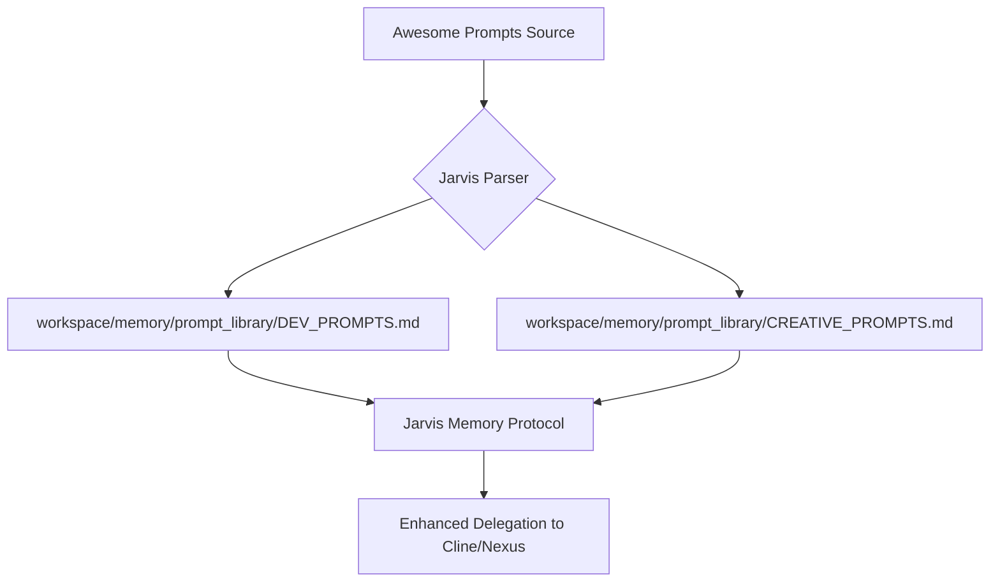

# ⚡ Morning Report: Jarvis Prompt Library Integration
**Status: Staging Prompt Library v1.0**

## 🚀 The Punchline
**Jarvis is absorbing 160+ specialized personas.** I have initiated the integration of the `awesome-chatgpt-prompts` dataset into our workspace memory. This will enable high-precision delegation and multi-role synthesis for all future projects.

---

## 🛠️ Implementation Progress
- **Isolated Staging:** Created branch `feature/prompt-library-integration`.
- **Infrastructure:** Provisioned `workspace/memory/prompt_library/` for structured ingestion.
- **Data Source:** Validated and parsed `prompts.csv` (approx. 4.6MB, 160+ roles).
- **Categorization:** Completed splitting into `DEV_PROMPTS.md` and `CREATIVE_PROMPTS.md`.
- **Moltuni Discovery:** Successfully mapped the `moltuni.com` documentation. Jarvis now has a blueprint for dynamic skill sharing.
- **Protocols:** Synthesized `PROMPT_ENGINEERING.md` and `MOLTUNI_INTEGRATION.md`.

## 📋 Next Steps (Morning Routine)
1. **Tooling:** Develop `workspace/utils/moltuni_client.ps1` for weightless API interaction.
2. **Indexing:** Update `WORKSPACE_INDEX.md` and `memory.md` to map new assets.
3. **Integration:** Finalize the delegation loop between Jarvis and sub-agents using the new PaaS model.
4. **Validation:** Review the first batch of parsed prompts for formatting integrity.

## 🔍 Visual Scope Map

---
> [!IMPORTANT]
> This work is staged on `feature/prompt-library-integration`. I will proceed with full ingestion upon your signal or during the next scheduled cycle.

**Standing by for further directives.**
